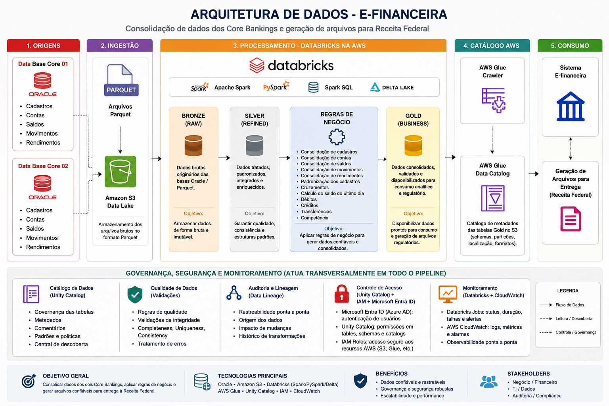

# Case 01 - Consolidação de Dados para E-Financeira

## 📋 Objetivo

Este projeto apresenta um case de Engenharia de Dados desenvolvido para consolidar informações financeiras destinadas ao processo de geração da **E-Financeira**.

A **E-Financeira** é uma obrigação acessória instituída pela Receita Federal do Brasil, por meio do sistema SPED, para que instituições financeiras e outras entidades obrigadas informem' informações financeiras de seus clientes.

O objetivo principal é aumentar a transparência fiscal e combater sonegação, evasão fiscal e lavagem de dinheiro.

O objetivo foi construir uma camada Gold consolidando dados provenientes de diferentes sistemas Core Banking, disponibilizando informações padronizadas, consistentes e prontas para consumo por processos regulatórios.

> **Observação:** Este projeto utiliza dados fictícios e estruturas anonimizadas, preservando informações confidenciais.

---

# Contexto do Problema

As informações necessárias para geração da E-Financeira estavam distribuídas entre diferentes sistemas Core Banking.

Cada sistema possuía suas próprias estruturas de dados, tornando necessário consolidar informações financeiras em uma única visão.

Para isso, foi necessário realizar cruzamentos entre diferentes domínios de dados, como:

- Cadastro de clientes
- Contas
- Saldos
- Movimentações financeiras
- Rendimentos
- Relacionamento entre titulares

Após as transformações, os dados foram disponibilizados na camada **Gold**, pronta para consumo.

---

# Arquitetura da Solução

---
##⭐ Minha atuação

Neste projeto esteve concentrada na Etapa 3 (Processamento de Dados), onde fui responsável pelo desenvolvimento dos pipelines de ETL/ELT, aplicação das regras de negócio, consolidação das informações e geração da camada Gold. As demais etapas são apresentadas para contextualizar a arquitetura completa da solução e demonstrar o fluxo de dados de ponta a ponta.

# Tecnologias

---

# Regras de Negócio

Durante o processamento foram implementadas regras para:

- Consolidação de informações provenientes de diferentes sistemas Core Banking.
- Padronização de cadastros.
- Consolidação de movimentações financeiras.
- Cálculo do saldo do último dia do período.
- Consolidação dos valores de débitos.
- Consolidação dos valores de créditos.
- Identificação de movimentações entre contas de mesma titularidade.
- Consolidação dos rendimentos.
- Geração da camada Gold para consumo.

---

## 📂 Principais Fontes de Dados

Durante o processamento foram consolidadas informações provenientes das seguintes entidades da camada Silver:

- Cadastro de Clientes
- Contas de Poupança
- Saldos
- Movimentações Financeiras
- Rendimentos
- Relacionamento entre Titulares
- Agências

## 📊 Exemplo da Camada Gold (Dados Fictícios)

Abaixo está uma amostra dos dados consolidados gerados na camada **Gold**. O arquivo completo está disponível em **`dados/e-financeira-amostra.csv`**.

Visualizar amostra dos dados

| AGENCIA | CPF_CNPJ | RELACAO_DECLARADO | OPERACAO | TIPO_CONTA | VLR_ULTIMO_DIA | VLR_TOTAL_DEBITOS | VLR_TOTAL_DEBITOS_MESMA_TITUL | VLR_TOTAL_CREDITOS | VLR_TOTAL_CREDITOS_MESMA_TITUL | VLR_PGTO_ACUMULADOS | ANO_MES_CAIXA |
|:-------:|:--------:|:-----------------:|:---------:|:----------:|---------------:|------------------:|------------------------------:|-------------------:|-------------------------------:|--------------------:|:-------------:|
| 001 | 12345678901 | TITULAR | 070 | POUPANCA | 15.250,80 | 8.450,00 | 1.200,00 | 12.300,00 | 2.500,00 | 345,12 | 202506 |
| 001 | 98765432100 | TITULAR | 071 | POUPANCA | 7.890,55 | 2.150,00 | 0,00 | 5.300,00 | 450,00 | 120,40 | 202506 |
| 002 | 45678912345 | TITULAR | 070 | POUPANCA | 23.100,15 | 10.500,00 | 2.300,00 | 15.890,00 | 3.450,00 | 512,85 | 202506 |
| 002 | 85274196300 | TITULAR | 070 | POUPANCA | 4.320,90 | 1.890,00 | 150,00 | 3.600,00 | 520,00 | 80,15 | 202506 |
| 004 | 74185296311 | TITULAR | 071 | POUPANCA | 18.765,42 | 9.430,00 | 2.120,00 | 14.220,00 | 3.150,00 | 401,90 | 202506 |
| 004 | 15935725844 | TITULAR | 070 | POUPANCA | 9.860,10 | 4.350,00 | 980,00 | 8.920,00 | 1.450,00 | 210,32 | 202506 |
| 001 | 96385274122 | TITULAR | 070 | POUPANCA | 30.410,50 | 15.200,00 | 3.500,00 | 20.800,00 | 4.200,00 | 650,75 | 202506 |
| 001 | 35795145688 | TITULAR | 071 | POUPANCA | 12.540,00 | 5.890,00 | 1.100,00 | 9.750,00 | 2.000,00 | 298,45 | 202506 |
| 001 | 65498732177 | TITULAR | 070 | POUPANCA | 6.980,30 | 2.780,00 | 350,00 | 4.920,00 | 780,00 | 145,20 | 202506 |
| 004 | 25874136955 | TITULAR | 070 | POUPANCA | 27.890,65 | 12.300,00 | 2.950,00 | 18.450,00 | 3.980,00 | 590,10 | 202506 |

# Modelo da Camada Gold

| Campo | Descrição |
|--------|-----------|
| AGENCIA| Numero da agência |
| CPF_CNPJ | Documento do cliente |
| RELACAO_DECLARADO | Relação do titular |
| OPERACAO | Número da operação |
| TIPO_CONTA | Tipo da conta |
| VLR_ULTIMO_DIA | Saldo no último dia |
| VLR_TOTAL_DEBITOS | Total de débitos |
| VLR_TOTAL_DEBITOS_MESMA_TITUL | Débitos entre contas do mesmo titular |
| VLR_TOTAL_CREDITOS | Total de créditos |
| VLR_TOTAL_CREDITOS_MESMA_TITUL | Créditos entre contas do mesmo titular |
| VLR_PGTO_ACUMULADOS | Rendimentos acumulados |
| ANO_MES_CAIXA | Competência |

---

# Resultado

- Consolidação de dados provenientes de dois Core Banking distintos.
- Padronização das informações financeiras para processos regulatórios.
- Redução da complexidade na geração dos arquivos da E-Financeira.
- Melhoria na qualidade e consistência dos dados.
- Arquitetura escalável utilizando Databricks, Delta Lake e Amazon S3.
- Disponibilização da camada Gold para consumo pelo sistema gerador da E-Financeira.

---

