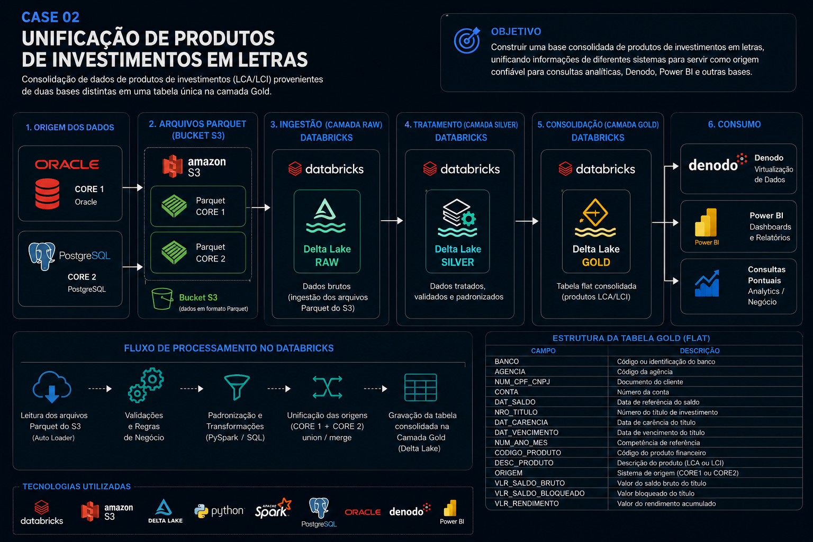

# Case 02 - Unificação de Produtos de Investimentos em Letras

---

# 📋 Objetivo

Desenvolver uma solução de Engenharia de Dados responsável pela consolidação de produtos de investimentos em letras (LCA e LCI), unificando informações provenientes de diferentes sistemas Core Banking em uma única tabela na camada Gold.

A base consolidada passou a servir como fonte de dados para consumo analítico, consultas pontuais e disponibilização através do Denodo e Power BI.

> **Observação:** Este projeto utiliza dados fictícios e estruturas anonimizadas, preservando informações confidenciais e regras proprietárias.

---

## Contexto

Os dados dos produtos de investimentos em letras (LCA e LCI) estavam distribuídos entre dois sistemas Core Banking distintos. As informações eram extraídas das bases Oracle e PostgreSQL e disponibilizadas em arquivos **Parquet** armazenados em um **Bucket Amazon S3**.

No ambiente Databricks, os dados eram ingeridos para a camada **Raw**, posteriormente tratados na camada **Silver** e utilizados como base para construção da camada **Gold**.

### Gargalo

O principal gargalo do processo era a ausência de uma base consolidada para consulta. Como consequência, as áreas de negócio solicitavam frequentemente consultas analíticas e extrações pontuais, obrigando a equipe de Engenharia de Dados a realizar cruzamentos diretamente sobre as tabelas da camada **Silver**.

Cada nova demanda exigia a construção de consultas específicas, envolvendo múltiplas tabelas e regras de negócio para consolidar informações provenientes dos dois Core Banking. Esse processo aumentava o tempo de atendimento das solicitações, gerava retrabalho e dificultava a padronização das informações consumidas pelas áreas de negócio.

### Solução

Minha atuação consistiu em desenvolver toda a etapa de transformação da camada **Silver → Gold**, implementando regras de negócio, padronizações e a unificação dos registros em uma única tabela **Flat**.

A nova estrutura passou a disponibilizar uma visão consolidada dos produtos de investimentos, tornando-se a principal fonte para consultas analíticas, consumo via Denodo, construção de dashboards no Power BI e reutilização por outras soluções de dados, reduzindo significativamente a necessidade de consultas diretas às tabelas da camada Silver.

---

# Arquitetura da Solução

---
# Tecnologias Utilizadas

- Databricks
- Apache Spark
- PySpark
- SQL
- Delta Lake
- Amazon S3
- Oracle
- PostgreSQL
- Denodo
- Power BI

---

# Principais atividades

- Leitura dos arquivos Parquet armazenados no Amazon S3.
- Transformação dos dados utilizando PySpark e SQL.
- Consolidação das informações provenientes de dois sistemas Core Banking.
- Padronização dos atributos dos produtos financeiros.
- Implementação das regras de negócio.
- Construção da camada Gold.
- Disponibilização da base para consumo analítico.

---

## Amostra de Dados (Fictícia)

Abaixo está um exemplo da estrutura final disponibilizada na camada **Gold** após a consolidação dos dados provenientes dos dois Core Banking.

| BANCO | AGENCIA | NUM_CPF_CNPJ | CONTA | DAT_SALDO | NRO_TITULO | DAT_CARENCIA | DAT_VENCIMENTO | NUM_ANO_MES | CODIGO_PRODUTO | DESC_PRODUTO | ORIGEM | VLR_SALDO_BRUTO | VLR_SALDO_BLOQUEADO | VLR_RENDIMENTO |
|-------:|--------:|:------------|:------|:----------|:-----------|:-------------|:----------------|------------:|---------------:|:-------------|:--------|----------------:|--------------------:|----------------:|
| 001 | 1001 | 12345678901 | 00012345 | 2025-06-30 | TIT000001 | 2025-01-15 | 2026-01-15 | 202506 | 101 | LCA | CORE1 | 150000.00 | 0.00 | 8450.22 |
| 001 | 1002 | 98765432100 | 00023456 | 2025-06-30 | TIT000002 | 2025-02-10 | 2026-02-10 | 202506 | 102 | LCI | CORE2 | 98500.50 | 0.00 | 5210.43 |
| 001 | 1003 | 74185296314 | 00034567 | 2025-06-30 | TIT000003 | 2025-03-05 | 2026-03-05 | 202506 | 101 | LCA | CORE1 | 252300.80 | 12000.00 | 12354.77 |
| 002 | 1004 | 36925814725 | 00045678 | 2025-06-30 | TIT000004 | 2025-01-20 | 2026-01-20 | 202506 | 102 | LCI | CORE2 | 87450.35 | 0.00 | 4589.11 |
| 002 | 1005 | 25896314785 | 00056789 | 2025-06-30 | TIT000005 | 2025-04-18 | 2026-04-18 | 202506 | 101 | LCA | CORE1 | 640000.90 | 50000.00 | 28654.19 |
| 001 | 1006 | 95175385246 | 00067890 | 2025-06-30 | TIT000006 | 2025-02-08 | 2026-02-08 | 202506 | 102 | LCI | CORE2 | 112300.40 | 0.00 | 6120.74 |
| 001 | 1007 | 75315945687 | 00078901 | 2025-06-30 | TIT000007 | 2025-03-12 | 2026-03-12 | 202506 | 101 | LCA | CORE1 | 215480.65 | 10000.00 | 11254.83 |
| 001 | 1008 | 85245615978 | 00089012 | 2025-06-30 | TIT000008 | 2025-01-05 | 2026-01-05 | 202506 | 102 | LCI | CORE2 | 56480.00 | 0.00 | 2847.16 |
| 001 | 1009 | 65498732145 | 00090123 | 2025-06-30 | TIT000009 | 2025-04-01 | 2026-04-01 | 202506 | 101 | LCA | CORE1 | 489750.22 | 25000.00 | 21564.32 |
| 001 | 1010 | 45632178954 | 00091234 | 2025-06-30 | TIT000010 | 2025-02-28 | 2026-02-28 | 202506 | 102 | LCI | CORE2 | 73480.55 | 0.00 | 3897.42 |

> **Observação:** Todos os dados apresentados são fictícios e foram criados exclusivamente para demonstração da estrutura da camada Gold.
---
# Estrutura da Tabela Gold

| Campo | Descrição |
|--------|-----------|
| BANCO | Banco |
| AGENCIA | Agência |
| NUM_CPF_CNPJ | Documento do cliente |
| CONTA | Conta |
| DAT_SALDO | Data do saldo |
| NRO_TITULO | Número do título |
| DAT_CARENCIA | Data de carência |
| DAT_VENCIMENTO | Data de vencimento |
| NUM_ANO_MES | Competência |
| CODIGO_PRODUTO | Código do produto |
| DESC_PRODUTO | LCA ou LCI |
| ORIGEM | CORE1 ou CORE2 |
| VLR_SALDO_BRUTO | Saldo bruto |
| VLR_SALDO_BLOQUEADO | Saldo bloqueado |
| VLR_RENDIMENTO | Rendimento acumulado |

---

# Resultado

Após a consolidação, foi disponibilizada uma tabela Gold padronizada contendo informações dos produtos de investimentos em letras, servindo como fonte única para consultas analíticas e consumo por diferentes aplicações corporativas.

---

# Tecnologias

