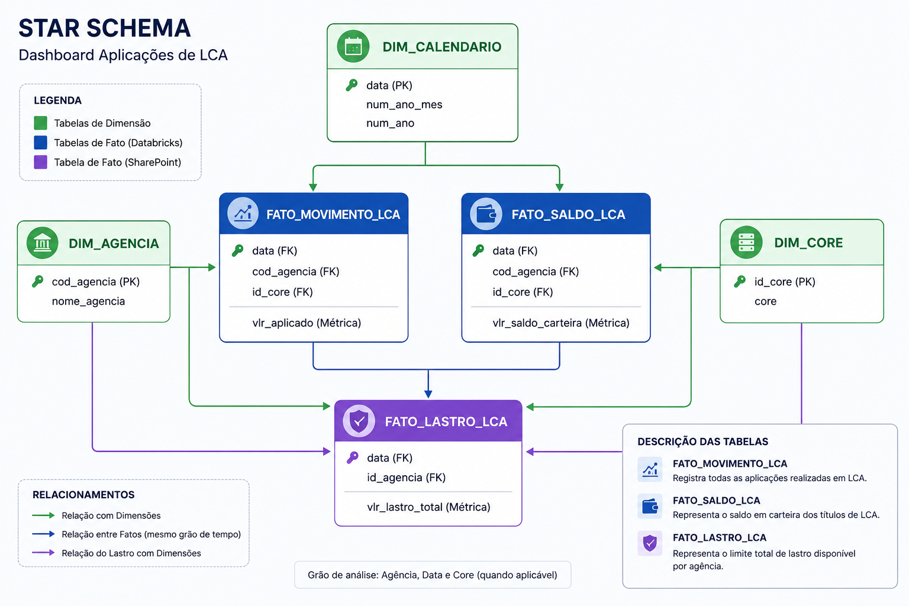
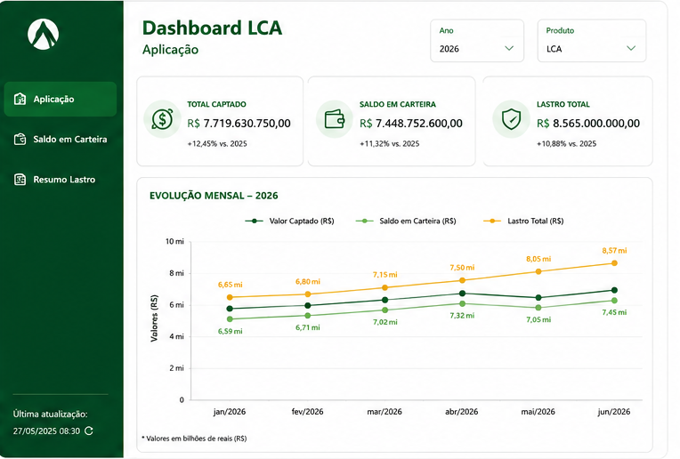
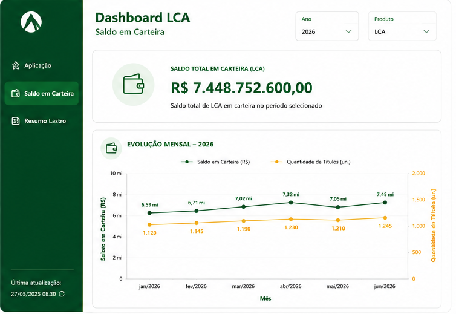
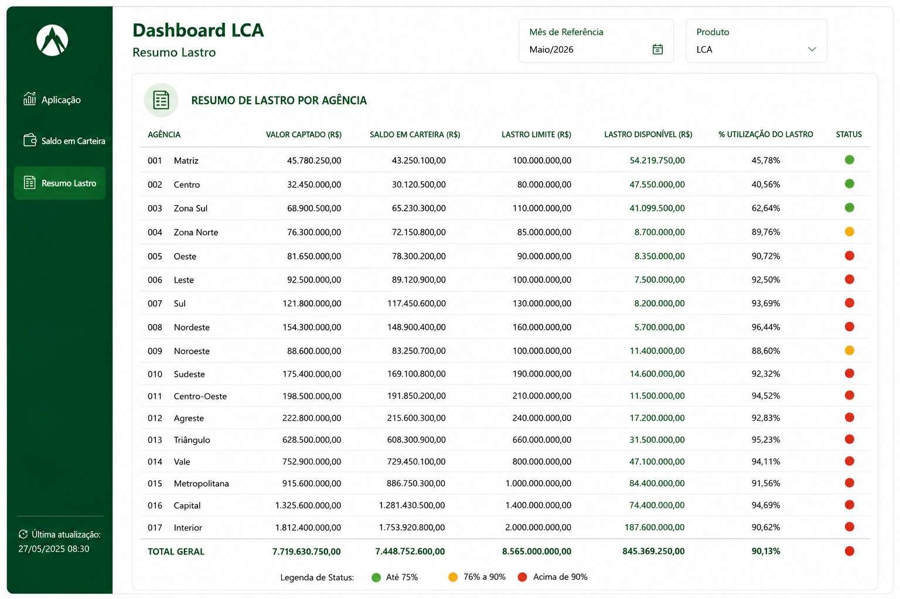

# 📊 CASE 02 - Dashboard de Aplicações em LCA e Controle de Lastro

## 📌 Contexto

A área de Produtos precisava enviar **diariamente** para todas as cooperativas uma planilha contendo o limite disponível de lastro para emissão de títulos de LCA.

Esse processo era totalmente manual, consumia tempo da equipe e dificultava a tomada de decisão pelas cooperativas, que dependiam dessas informações para continuar ofertando novos títulos de LCA ao longo do dia.

Além do esforço operacional, as informações não possuíam uma visualização consolidada, dificultando o acompanhamento da evolução das aplicações e da utilização do lastro.

---

## 🚨 Problema

Antes da implantação da solução:

- Processo manual de geração de planilhas todos os dias;
- Alto esforço operacional da área de Produtos;
- Baixa visibilidade sobre o consumo do lastro;
- Dificuldade das cooperativas em acompanhar a capacidade de novas emissões de LCA;
- Ausência de indicadores consolidados para apoio à decisão.

---

## 🎯 Objetivo

Disponibilizar um Dashboard em Power BI que permitisse às cooperativas acompanhar, em tempo real:

- Valor total captado em LCA;
- Saldo em carteira;
- Limite de lastro disponível;
- Evolução das aplicações;
- Quantidade de títulos emitidos;
- Consumo do lastro por agência.

A solução eliminou o envio manual de planilhas e tornou as informações disponíveis de forma visual e centralizada.

---

---

# ⭐ Modelagem Star Schema




---

## 📂 Tabelas utilizadas

### Origem: Databricks

### Dimensão Agência

| Campo |
|--------|
| cod_agencia |
| nome_agencia |

---

### Dimensão Calendário

| Campo |
|--------|
| data |
| num_ano_mes |
| num_ano |

---

### Dimensão Core

| Campo |
|--------|
| id_core |
| core |

---

### Fato Movimento LCA

| Campo |
|--------|
| data |
| cod_agencia |
| id_core |
| vlr_aplicado |

Representa todas as aplicações realizadas em LCA.

---

### Fato Saldo LCA

| Campo |
|--------|
| data |
| cod_agencia |
| id_core |
| vlr_saldo_carteira |

Responsável pelo saldo em carteira dos títulos.

---

### Origem: SharePoint

### Fato Lastro LCA

| Campo |
|--------|
| data |
| id_agencia |
| vlr_lastro_total |

Tabela responsável pelo limite total de lastro disponível por agência.

---

# 📐 Principais Métricas

## Valor Captado

```DAX
SUM(vlr_aplicado)
```

---

## Saldo em Carteira

```DAX
SUM(vlr_saldo_carteira)
```

---

## Lastro Total

```DAX
SUM(vlr_lastro_total)
```

---

## Lastro Disponível

```text
Lastro Disponível =
Lastro Total - Valor Captado
```

---

## % Utilização do Lastro

```text
% Utilização =
Valor Captado / Lastro Total
```

---

## Status do Lastro

| Utilização | Status |
|------------|--------|
| Até 75% | 🟢 Verde |
| 76% até 90% | 🟡 Amarelo |
| Acima de 90% | 🔴 Vermelho |

---

# 📊 Dashboard Desenvolvido

## Página 1 — Aplicações

Nesta página foram disponibilizados:

- Valor Captado Total
- Lastro Total Disponível
- Evolução diária das aplicações
- Quantidade diária de títulos emitidos

> Inserir imagem da Página 1





---

## Página 2 — Saldo em Carteira

Nesta página é possível acompanhar:

- Saldo total em carteira
- Evolução mensal do saldo
- Evolução da quantidade de títulos

> Inserir imagem da Página 2





---

## Página 3 — Resumo Lastro

Visão analítica por agência contendo:

- Valor Captado
- Saldo em Carteira
- Lastro Limite
- Lastro Disponível
- % Utilização do Lastro
- Status visual através de semáforo

> Inserir imagem da Página 3





---

# 🚀 Tecnologias Utilizadas

- Databricks
- SQL
- Power BI
- DAX
- SharePoint
- Star Schema

---

# 💡 Resultado

Com a implantação do Dashboard:

- Eliminação da geração manual de planilhas;
- Maior agilidade na disponibilização das informações;
- Acompanhamento em tempo real do consumo do lastro;
- Melhor apoio à tomada de decisão pelas cooperativas;
- Visibilidade gerencial através de indicadores consolidados;
- Redução do esforço operacional da área de Produtos.

---

> **Observação:** Este projeto utiliza dados e imagens ilustrativas. O objetivo é demonstrar a arquitetura da solução, modelagem dos dados e as técnicas empregadas, preservando informações confidenciais da instituição.


### Tecnologias utilizadas


