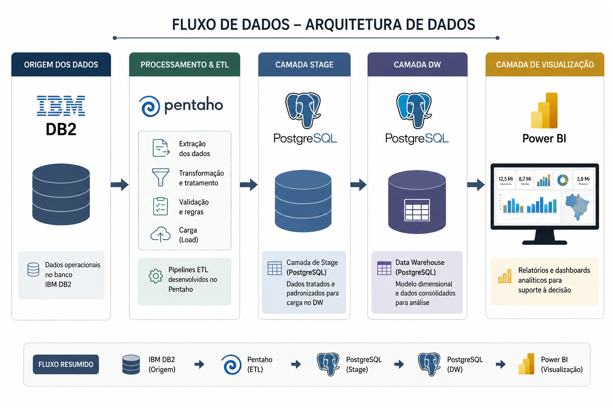
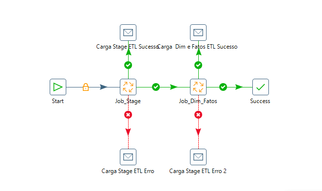
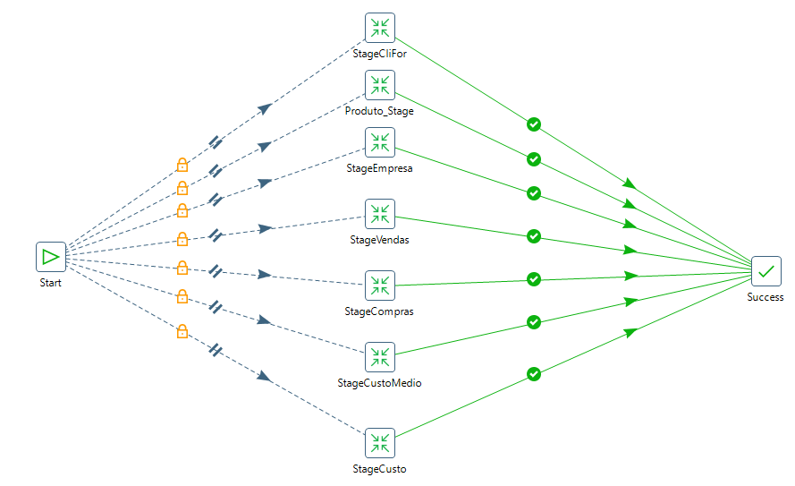
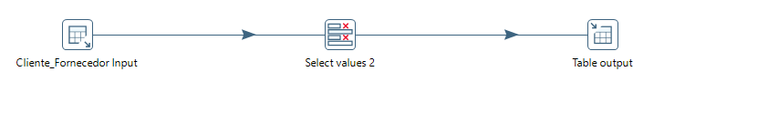
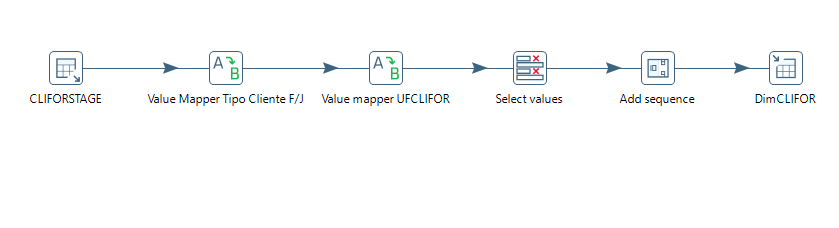
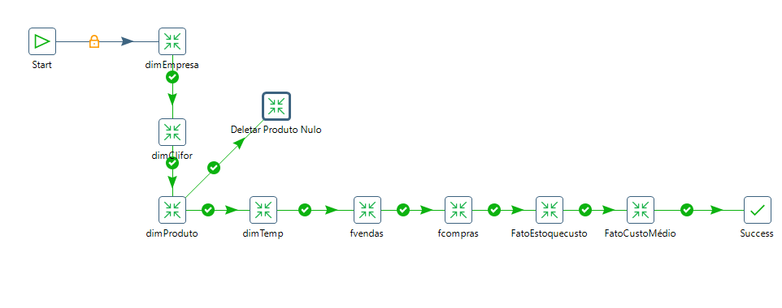
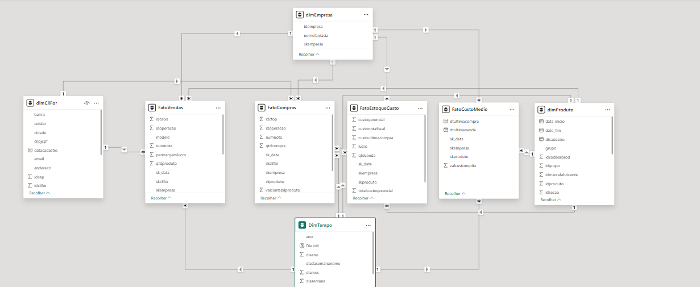
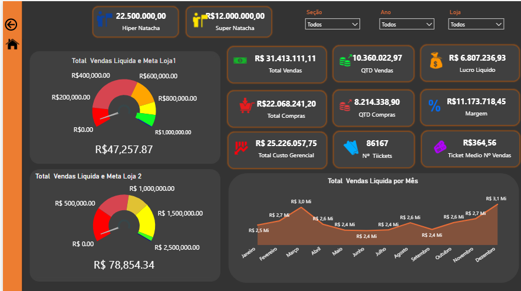
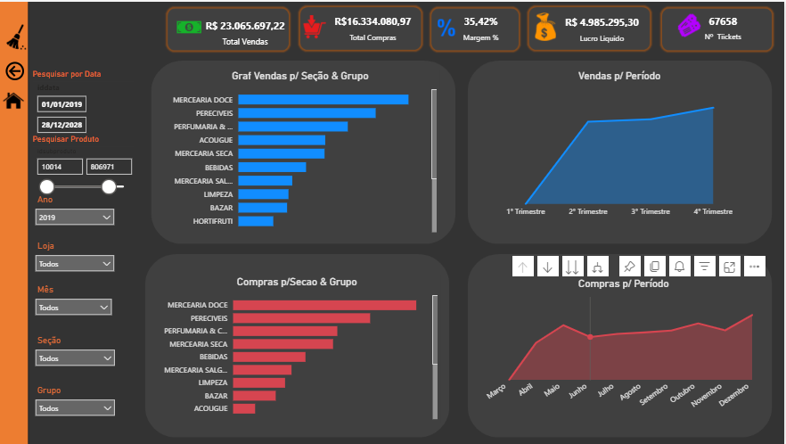
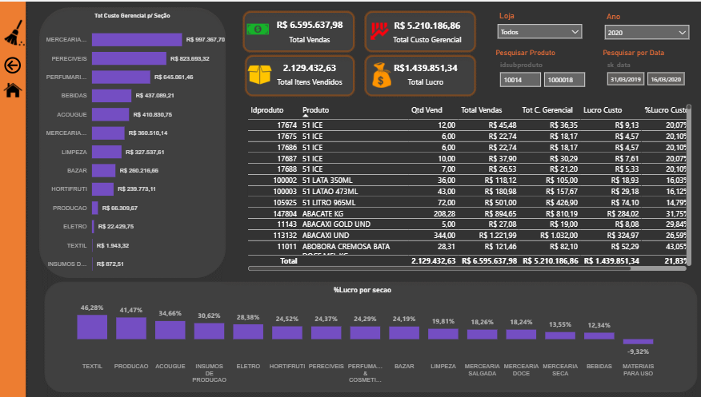

# Case 04 - Business Intelligence para o Segmento de Supermercados


---

> **Aviso:** Este case foi inspirado em um projeto real desenvolvido para uma empresa do segmento de varejo alimentar. Todas as informações sensíveis foram removidas ou anonimizadas. Os dados apresentados são fictícios e utilizados exclusivamente para demonstração técnica.

---

# 1-Objetivo

Desenvolver uma solução de Business Intelligence capaz de centralizar informações comerciais e financeiras da empresa, reduzindo consultas operacionais, eliminando atividades repetitivas e disponibilizando indicadores estratégicos por meio de dashboards no Power BI.

---

# 2-Contexto

Antes da implantação da solução de Business Intelligence, os gestores precisavam acessar diversas telas do sistema operacional para consultar informações relacionadas ao desempenho da empresa.

Indicadores como faturamento, compras, lucro líquido, margem de lucro, custos, estoque  eram obtidos manualmente, exigindo diversas consultas ao sistema e consolidação das informações em planilhas.

Esse processo consumia tempo, demandava esforço operacional recorrente e dificultava o acompanhamento dos resultados do negócio.

Além disso, diferentes usuários realizavam consultas distintas para obter os mesmos indicadores, aumentando o retrabalho e reduzindo a padronização das informações utilizadas pela empresa.

---

# 3-Desafio

O principal desafio do projeto consistia em transformar dados operacionais armazenados no IBM DB2 em informações gerenciais padronizadas, permitindo que toda a organização consultasse os indicadores em um único ambiente analítico.

---

# 4-Solução Desenvolvida

Foi desenvolvida uma solução completa de Business Intelligence utilizando Pentaho Data Integration (PDI), PostgreSQL e Power BI.

O processamento foi dividido em duas etapas principais:

- Construção da camada Stage.
- Construção do Data Warehouse utilizando modelagem dimensional (Star Schema).

Após o processamento dos dados, os dashboards são disponibilizados no Power BI para acompanhamento dos principais indicadores da empresa.

---

# 5-Arquitetura da Solução




## 5.1-Arquitetura dos Processos ETL

O processo ETL foi orquestrado através de um Job Principal responsável pela execução das cargas da camada Stage e posteriormente das Dimensões e Tabelas Fato.

### Fluxo Geral




---

### Camada Stage




Nesta etapa eram realizadas as extrações das tabelas do IBM DB2, aplicação das regras iniciais de negócio e preparação dos dados para construção do Data Warehouse.

Foram desenvolvidos processos independentes para:

- Stage Cliente / Fornecedor
- Stage Produtos
- Stage Empresas
- Stage Vendas
- Stage Compras
- Stage Custo Médio
- Stage Custo Gerencial

Durante essa etapa foram utilizadas transformações do Pentaho como:

- Value Mapper
- Select Values
- Merge Rows (Diff)
- Add Sequence
- Execute SQL Script
- Table Input
- Table Output

---

### Visualizando a stage e a dimensao Cliente / Fornecedor como exemplo
### Stage Cliente


### Dimensao cliente 



---


# 6.0-Construção do Data Warehouse



Após a conclusão da Stage foi criado o processo de construção do modelo dimensional.

Foram desenvolvidas as seguintes dimensões:

- DimEmpresa
- DimClienteFornecedor
- DimProduto
- DimTempo

E as seguintes tabelas fato:

- FatoVendas
- FatoCompras
- FatoEstoqueCusto
- FatoCustoMedio

Essas estruturas passaram a servir como base para toda a camada analítica da empresa.

---

##  6.1-Modelagem Dimensional





Foi adotada uma arquitetura **Star Schema**, permitindo reutilização das dimensões por diferentes tabelas fato e melhor desempenho nas consultas analíticas.

### Dimensões

- DimEmpresa
- DimClienteFornecedor
- DimProduto
- DimTempo

### Tabelas Fato

- FatoVendas
- FatoCompras
- FatoEstoqueCusto
- FatoCustoMedio

A utilização desse modelo proporcionou maior desempenho nas consultas, simplificação da construção dos dashboards e padronização dos indicadores corporativos.

---

### 6.1.1-Fontes de Dados

As informações eram extraídas do banco IBM DB2 a partir das seguintes tabelas:

| Tabela | Finalidade |
|---------|------------|
| `DBA.NOTAS` | Movimentações de entrada e saída |
| `DBA.CLIENTE_FORNECEDOR` | Cadastro de clientes e fornecedores |
| `DBA.EMPRESA` | Informações das empresas |
| `DBA.ESTOQUE_SALDO_ATUAL` | Custo médio dos produtos |
| `DBA.SECAO` | Classificação dos produtos |
| `DBA.ESTOQUE_ANALITICO` | Informações gerenciais de estoque |
| `DBA.POLITICA_PRECO_PRODUTO` | Política de preços |
| `DBA.PRODUTOS_VIEW` | Cadastro dos produtos |

### 6.1.2-Tabelas Geradas na camada Stage


| Tabela Stage | Finalidade |
|---|---|
| `TB_VENDAS` | Armazenamento e preparação das movimentações de vendas utilizadas na construção da `FatoVendas`. |
| `TB_CLIFOR` | Consolidação dos dados cadastrais de clientes e fornecedores utilizados na construção da `DimCliFor`. |
| `TB_COMPRAS` | Armazenamento e preparação das movimentações de compras utilizadas na construção da `FatoCompras`. |
| `TB_PRODUTO` | Consolidação dos dados cadastrais e atributos dos produtos utilizados na construção da `DimProduto`. |
| `TB_EMPRESA` | Consolidação das informações cadastrais das empresas utilizadas na construção da `DimEmpresa`. |
| `TB_CUSTO` | Preparação das informações de custo gerencial utilizadas na construção da `FatoEstoqueCusto`. |
| `TB_CUSTOMEDIO` | Preparação das informações de custo médio dos produtos utilizadas na construção da `FatoCustoMedio`. |


### 6.1.3-Tabelas Geradas no DW 


#### Dimensões

| Dimensão | Finalidade |
|---|---|
| `DimCliFor` | Armazenamento dos atributos de clientes e fornecedores. |
| `DimEmpresa` | Armazenamento das informações cadastrais das empresas. |
| `DimProduto` | Armazenamento dos atributos, classificações e informações cadastrais dos produtos. |
| `DimTempo` | Estrutura temporal utilizada nas análises por dia, mês, ano e demais períodos. |

#### Tabelas Fato

| Tabela Fato | Finalidade |
|---|---|
| `FatoVendas` | Armazenamento das movimentações, valores e indicadores relacionados às vendas. |
| `FatoCompras` | Armazenamento das movimentações e indicadores relacionados às compras. |
| `FatoCustoMedio` | Armazenamento dos valores relacionados ao custo médio dos produtos. |
| `FatoEstoqueCusto` | Armazenamento das informações de estoque e custo gerencial. |

---

#### Utilização de Surrogate Keys

As dimensões foram estruturadas utilizando **Surrogate Keys (SKs)**, chaves artificiais geradas durante os processos ETL.

Essas chaves foram utilizadas para estabelecer os relacionamentos entre as dimensões e as tabelas fato no modelo Star Schema.

Exemplo dos relacionamentos da `FatoVendas`:

```text
DimTempo
    │
    │ SK_DATA
    ▼

DimCliFor ───► FatoVendas ◄─── DimEmpresa
 SKCLIFOR                         SKEMPRESA

                   ▲
                   │
               SKPRODUTO
                   │

              DimProduto
```

A utilização de Surrogate Keys proporcionou:

- Independência das chaves naturais dos sistemas de origem.
- Padronização dos relacionamentos no Data Warehouse.
- Melhor integração entre dimensões e tabelas fato.
- Maior controle sobre alterações nos registros dimensionais.
- Simplificação do modelo de relacionamento no Power BI.
- Maior consistência e integridade do modelo analítico.

---

#### Estrutura da FatoVendas

> A `FatoVendas` é apresentada como exemplo da estrutura do modelo dimensional. As demais tabelas fato foram desenvolvidas para atender aos respectivos domínios de compras, custo médio e custo gerencial de estoque.

A tabela `FatoVendas` foi desenvolvida para armazenar informações quantitativas e indicadores relacionados às operações de vendas.

As Surrogate Keys permitiam o relacionamento da tabela fato com as dimensões de tempo, cliente/fornecedor, empresa e produto.

| Campo | Descrição |
|---|---|
| `id_caixa` | Identificador do caixa relacionado à operação. |
| `id_operacao` | Identificador da operação de venda. |
| `modelo` | Modelo do documento fiscal. |
| `numnota` | Número da nota ou documento da operação. |
| `permargemlerco` | Percentual de margem relacionado à operação. |
| `qtd_produto` | Quantidade do produto vendida. |
| `sk_data` | Surrogate Key utilizada no relacionamento com a `DimTempo`. |
| `skclifor` | Surrogate Key utilizada no relacionamento com a `DimCliFor`. |
| `skempresa` | Surrogate Key utilizada no relacionamento com a `DimEmpresa`. |
| `skproduto` | Surrogate Key utilizada no relacionamento com a `DimProduto`. |
| `tipomovimento` | Tipo de movimentação da operação. |
| `valdescontofinanceiro` | Valor do desconto financeiro aplicado. |
| `valdescontopro` | Valor do desconto aplicado ao produto. |
| `vallucro` | Valor do lucro obtido na operação. |
| `valtotbruto` | Valor total bruto da venda. |
| `valtotliquido` | Valor total líquido da venda. |
| `valunitbruto` | Valor unitário bruto do produto. |
| `totaldesconto` | Valor total dos descontos aplicados à operação. |


### 6.1.4-Algumas visões no PBI 
#### Dados Geral 
---

#### Dados por período
---

---
#### Custo Gerencial



### Indicadores Disponibilizados

A solução permitiu centralizar indicadores como:

- Total de Vendas
- Total de Compras
- Lucro Líquido
- Margem de Lucro
- Custo Médio
- Custo Gerencial
- Estoque
- Evolução das vendas
- Comparativos por período
- Comparativos por empresa
- Comparativos por seção
- Indicadores por produto

---


# 7.0 🛠️ Tecnologias e Conceitos Utilizados


---

# 8.0-Minha Atuação

Atuei durante todo o ciclo de desenvolvimento da solução de Business Intelligence, participando desde o levantamento dos requisitos até a disponibilização dos dashboards.

Principais atividades desenvolvidas:

- Levantamento de requisitos junto às áreas de negócio.
- Identificação das fontes de dados no IBM DB2.
- Desenvolvimento dos processos ETL utilizando Pentaho.
- Construção da camada Stage.
- Desenvolvimento do Data Warehouse.
- Modelagem Dimensional (Star Schema).
- Desenvolvimento das Dimensões e Tabelas Fato.
- Desenvolvimento de consultas SQL.
- Criação de indicadores utilizando DAX.
- Desenvolvimento dos dashboards no Power BI.

---

# 9.0-Resultado

Após a implantação da solução, as áreas de negócio passaram a consultar os principais indicadores em um único ambiente analítico.

Os dashboards substituíram consultas manuais realizadas diretamente no sistema operacional, reduzindo significativamente o tempo gasto na obtenção das informações.

Entre os principais benefícios obtidos destacam-se:

- Centralização dos indicadores da empresa.
- Redução de atividades manuais e repetitivas.
- Maior agilidade na tomada de decisão.
- Padronização das informações.
- Melhor desempenho das consultas analíticas.
- Disponibilização de informações históricas.
- Visão consolidada do desempenho comercial e financeiro.

